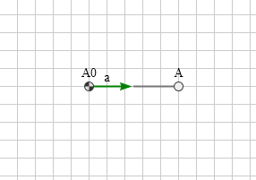
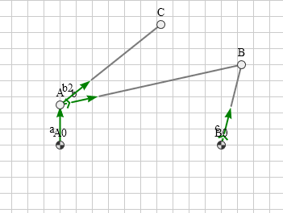
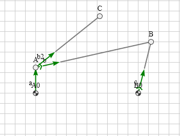
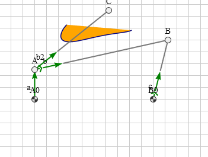
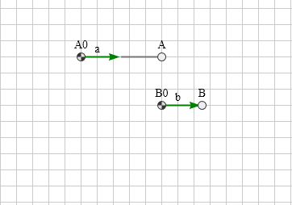
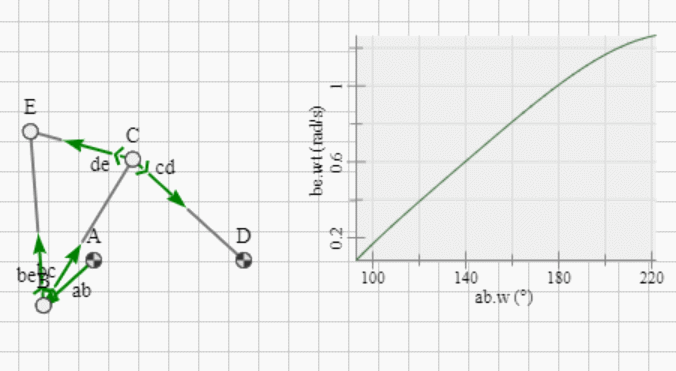
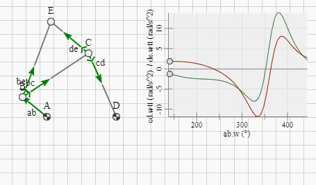

## Drive Sequence

Drive functions can be composed as a sequence (`'func':'seq'`) of normalized functions, being one of `['const', 'linear', 'quadratic', 'harmonic', 'sinoid', 'poly5']` each. Every segment of a drive sequence must specify its function type `func`, its duration `dt` (always positive) and its value range `dz` (might be negative).

<figure>
  
  <figcaption>Fig.1: Ramp drive - Duration 5 Seconds.</figcaption>
</figure>

```js
"constraints":[
    {"id":"a","p1":"A0","p2":"A",
     "len":{"type":"const"},
     "ori":{"type":"drive","func":"seq","Dt":5,"Dw":0.5326,
                           "args": [ {"func":"quadratic","dt":3,"dz":1},
                                     {"func":"const","dt":2},
                                     {"func":"quadratic","dt":3,"dz":-1}
                            ]
           }
    }
]
```

## Views

The `views` array holds properties the user wants to display during simulation. Each *view* element has three primary properties `{"show","of","as"}`. Examples:
```json
{"show":"velPole","of":"b","as":"point"},
{"show":"acc","of":"C","as":"vector","at":"pos"},
{"show":"wt","of":"b","as":"info"},
{"show":"pos","of":"C","as":"trace"},
{"show":"wt","of":"c","as":"chart"}
{"show":"polAcc","of":"b","as":"vector","at":"pole"},
```

### Show as Point

Show as point has the following properties:

| property| value | comment |
|:-----|:---|:---|
| `show` | property name | Must be an existing property name of the referenced element. |
| `of` | element reference | Must be an existing element id or the string `"model"`. |
| `as` | `"point"` | Obligatory |
| `by` | `["dot"]` | Symbol type must be one of `["dot","gnd","pol"]` |


The following element properties are supported to be shown as point:

| show as point| of | comment |
|:-----|:---|:---|
| `pos` | node | It rarely makes sense to show the node position additionally as a point view |
| `cog` | model | Center of gravity of all nodes (no base nodes). |
| `pole`, `velPole` | constraint | Instance centre of velocity |
| `accPole` | constraint | Instance centre of acceleration |
| `inflPole` | constraint | Inflection pole |


### Show as Vector

Show as vector has the following properties:

| property| value | comment |
|:-----|:---|:---|
| `show` | property name | Must be an existing property name of the referenced element. |
| `of` | element reference | Must be an existing element id or the string `"model"`. |
| `as` | `"vector"` | Mendatory |
| `at` | [node id] | Defines the anchor, at which the vector ist connected to. The default anchor depends on the property. Alternatively a node id can be specified to use that node coordinates for anchoring. |

The following element properties are supported to be shown as a vector.

| show as vector | of | at(default) | comment |
|:-----|:---|:---|:---|
| `vel` | node | node coordinates | Node velocity |
| `acc` | node | node coordinates | Node acceleration |
| `polChgRate` | constraint | Pole coordinates | Change rate of pole location |
| `polAcc` | constraint | Pole coordinates | Pole acceleration |


### Show as Trace

Show as trace has the following properties:

| property| value | comment |
|:-----|:---|:---|
| `show` | property name | Must be an existing property name of the referenced element returning a point. |
| `of` | element reference | Must be an existing element id or the string `"model"`. |
| `as` | `"trace"` | Obligatory |
| `t0` | `[0]` | Model time to start tracing. |
| `Dt` | `[1]` | Time span while tracing. |
| `mode` | `["dynamic"]` | Must be one of `["static", "dynamic", "preview"]` (See below) |
| `ref` | [constraint id] | Constraint id used as a reference coordinate system, with respect to which the trace coordinates are transformed. |
| `stroke` | `["black"]` | Stroke web color. |
| `fill` | `["transparent"]` | Fill web color. |

The following element properties are supported to be shown as a trace.

| property| value | comment |
|:-----|:---|:---|
| `pos` | node | Node position. Use it for generating coupler curves. |
| `cog` | model | Center of gravity of all nodes (no base nodes). |
| `pole`, `velPole` | constraint | Instance centre of velocity |
| `accPole` | constraint | Instance centre of acceleration |
| `inflPole` | constraint | Inflection pole |


Tracing starts from time `t0` during a defined time span `Dt`. Its behavior is controlled by a property `mode` of type `string` being one of `['static','dynamic','preview']`.

#### mode `static`

During constantly advancing model time `model.timer.t` the trace polyline is created between `t0` and `t0+Dt`. Mode `static` is not available with `input` drives.

<figure>
  
  <figcaption>Fig.1: static mode</figcaption>
</figure>

```js
"views":[
    {"show":"pos","of":"C","as":"trace","t0":1,"Dt":1,
     "mode":"static","fill":"orange"}
]
```

#### mode `dynamic`

During constantly advancing model time `model.timer.t` the polyline is created starting at `t0`, then adding points to the polyline until end of simulation, but holding not more than points generated at the past time span `Dt`. Mode `dynamic` is not available with `input` drives.

<figure>
  
  <figcaption>Fig.2: dynamic mode</figcaption>
</figure>

```js
"views":[
    {"show":"pos","of":"C","as":"trace","t0":1,"Dt":1,
     "mode":"dynamic","fill":"orange"}
]
```
#### mode `preview`

Before starting the simulation there is now a preview step looking for view elements requesting preview. When some are present, a background simulation using a time step `dt=1/30` seconds is done first until the largest `t0+Dt` time value. So when starting the simulation, the precalculated polyline is already there. Mode `preview` is available with `input` drives. It is especially useful when editing.

<figure>
  
  <figcaption>Fig.3: preview mode</figcaption>
</figure>

```js
"views":[
    {"show":"pos","of":"C","as":"trace","t0":1,"Dt":1,
     "mode":"preview","fill":"orange"}
]
```

#### Relative Point Path

The trace of a point might also be recorded with respect to a moving coordinate system specified by a vector constraint via `ref` property, into which the trace points are transformed.

<figure>
  
  <figcaption>Fig.1: Cam contour generation.</figcaption>
</figure>

```js
"views":[
    {"show":"pos","of":"A","as":"trace","ref":"b","mode":"static","Dt":5}
]
```

### Show as chart

Show as chart has the following properties:

| property| value | comment |
|:-----|:---|:---|
| `xaxis` | `{}` | Represents the x-axis is to be filled with various properties (See below) |
| `yaxis` | `{} | []` | Represents the y-axis is to be filled with an y-axis object or an array of those (See below) |
| `as` | `"chart"` | Obligatory |
| `t0` | `[0]` | Model time to start filling the chart. |
| `Dt` | `[1]` | Time span while recording. |
| `mode` | `["dynamic"]` | Must be one of `["static", "dynamic", "preview"]` (See below) |
| `x` |`0`| x position of chart area's lower left corner. |
| `y` |`0`| y position of chart area's lower left corner. |
| `b` |`150`| breadth / width of chart area. |
| `h` |`100`| height of chart area. |

Fill the xaxis and yaxis Objects with the following properties:
| property| value | comment |
|:-----|:---|:---|
| `show` | property name | Must be an existing property name of the referenced element returning a point, constraint or time, depending of the chosen `of` property. |
| `of` | element reference | Must be an existing element id or `timer` |

The following element properties are supported to be shown in a chart: <br>
Please note, that properties must correspond according the selected element

| property| value | comment |
|:-----|:---|:---|
| `t` | number | Current time. Must be used with a timer. |
| `accAbs` | number | Absolute acceleration of a point. |
| `velAbs` | number | Absolute speed of a point. |
| `absForce` | number | Applied force of a point. |
| `w` | number | Current angle of a constraint. |
| `wt` | number | Current angular speed of a constraint. |
| `wtt` | number | Current angular acceleration of a constraint. |
| `r` | number | Current length of a constraint. |
| `rt` | number | Current speed of a constraint. |
| `rtt` | number | Current acceleration of a constraint. |

Recording starts from time t0 during a defined time span Dt. Its behavior is controlled by a property mode of type string being one of ['static','dynamic','preview'], which are very analogous to modes in **Trace**.

#### mode `static`

During constantly advancing model time `model.timer.t` the trace polyline is created between `t0` and `t0+Dt`.

<figure>
  
  <figcaption>Fig.1: static mode</figcaption>
</figure>

```js
"views": [
    { "as": "chart", "x":175, "b":200, "h":150,"t0":0,"Dt":2,"mode":"static",
        "yaxis": {"show":"wt","of":"be"},
        "xaxis":{"of":"ab","show":"w"}
    },
]
```

#### mode `dynamic`

During constantly advancing model time `model.timer.t` the recording is created starting at `t0`, then adding points, but holding not more than points generated at the past time span `Dt`.

<figure>
  
  <figcaption>Fig.2: dynamic mode</figcaption>
</figure>

```js
"views": [
    { "as": "chart", "x":175, "b":200, "h":150,"t0":0.25,"Dt":2,"mode":"dynamic",
        "yaxis": [
            {"show":"wtt","of":"cd"},
            {"show":"wtt","of":"de"},
    ],
        "xaxis":{"of":"ab","show":"w"}
    },
]
```

#### mode `preview`

Before starting the simulation there is a preview step looking for view elements requesting preview. When some are present, a background simulation using a time step `dt=1/30` seconds is done first until the largest `t0+Dt` time value. So when starting the simulation, the precalculated chart is already there. Additional nods are drawn for each function on their respective curve.

<figure>
  
  <figcaption>Fig.2: preview mode</figcaption>
</figure>

```js
"views": [
    { "as": "chart", "x":175, "b":200, "h":150,"t0":0.25,"Dt":1.75,"mode":"preview",
        "yaxis": [
            {"show":"wtt","of":"cd"},
            {"show":"wtt","of":"de"},
    ],
        "xaxis":{"of":"ab","show":"w"}
    },
]
```

## Perfomance Hints (For Implementers only)

* At `init` state creation of temporary objects is mostly avoided. Existing objects are modified or extended.
* The inner animation loop consisting of the sequence `model.pre().itr().post()` should run in the time frame of `1/60`th seconds - including user interaction - in order to achive real time behavior. Inside of that loop ...
    * Avoid creating temporary objects, as they must be removed by the garbage collector regularly. Don't rely on JIT compiler optimzing here. So avoid ... 
        * array methods returning arrays as `keys, map, values, ...`
        * `Object` or `Array` methods requiring a temporary function argument.
    * Do not use antiquated ES5 `forEach` loop in favor of much more performant ES6 `for...of` loop.
    * Try to keep array modifications at a minimum.
* Functional programming has its charm. But its paradigma to not modifying arguments but returning modified copies of them instead, does not fit very well with the performance requirements of the inner animation loop of a physics engine.

## Nodes

* Nodes are required to have a valid and unique `id` property of type string.
* Nodes must not have a mass value of `0`. Default mass is `1`. Unit is [kg].

## Loads

* Load elements should have a valid and in this case unique `id` property of type string.
* Load elements with `type` of `['force', 'spring']` are supported.

### Force

* Forces are acting on nodes exclusively. So they are required to have a valid reference `p` to a node.
* The force value `value` must be a positive number greater than zero interpreted as [`N`]. Default value is `1N`.
* Initial force orientation can be set by `w0` in [rad].
* Force orientation can be static or dynamic. In the dynamic case the orientation is referred to the orientation of a constraint specified by `wref` as a valid reference. `w0` is interpreted as an offset to the referenced constraint then.
* A drawing mode `mode` as one of `['push','pull']` specifies, how the force arrow is rendered. Default is `pull`.

### Spring

* Springs are acting between to nodes. So they are required to have two valid references `p1` and `p2` to these nodes.
* The spring rate `k` must be a positive number greater than zero interpreted as [`N/cm`]. Default value is `1 N/cm`.
* Initial spring length of the unloaded spring can be set by `len0`. If not specified, the initial distance between `p1` and `p2` is taken.

## Shapes

* Shape elements can be connected with nodes and/or constraints
* Shape elements may have a valid and in this case unique `id` property of type string.
* Shape elements with `type` of `['fix', 'flt', 'slider', 'bar', 'beam', 'wheel', 'poly', 'img']` are supported.

### Fix

* Fixed nodes (supports) are connected to a node, which is usually a base node.
* They need to have a valid reference `p` to their node.
* Fixed nodes have a fixed orientation specified by `w0` (default value `0`).

### Flt

* Floating nodes (supports) are connected to a node.
* They need to have a valid reference `p` to their node.
* Floating nodes have a fixed orientation specified by `w0` (default value `0`).

### Slider

* Slider shapes are connected to a node.
* They need to have a valid reference `p` to their node.
* Slider shapes have a fixed orientation specified by `w0` (default value `0`).
* Alternatively slider shapes can have an optional reference `wref` to a constraint for aligning their orientation to it. `w0` is interpreted as a constant relative angular difference then.

### Bar

* Bar shapes are defined between two nodes.
* They need to have valid references `p1` and `p2` to their nodes.

### Beam

* Beam shapes are connected to a node.
* They need to have a valid reference `p` to their node.
* Beam shapes have a constant length `len`.
* Beam shapes have a valid reference `wref` to a constraint for aligning their orientation to it.

### Wheel

* Wheel shapes are connected to a node.
* They need to have a valid reference `p` to their node.
* Wheel shapes have a valid reference `wref` to a constraint for aligning their orientation to it.
* Wheel shapes have a constant offset angle `w0` to their referenced constraint.
* Wheel shapes have a constant radius `r`.

### Poly

* Polygon shapes must have `pts` array containing at least two points in global coordinates.
* Polygon shapes are connected to a reference node.
* They need to have a valid reference `p` to their reference node.
* Polygon shapes have a fixed orientation specified by `w0` (default value `0`).
* Polygon shapes can have an optional reference `wref` to a constraint for aligning their orientation to it. `w0` is interpreted as a constant relative angular offset then.

### Img

* Image shapes must have a uniform resource locator string `uri` defined.
* Image shapes are connected to a reference node.
* They need to have a valid reference `p` to their reference node.
* Image shapes are connected with their lower left corner to their node (cartesian coordinate system assumed).
* A local offset to the lower left corner can be specified by `xoff` and `yoff`.
* Image shapes have a fixed orientation specified by `w0` (default value `0`).
* Image shapes can have an optional reference `wref` to a constraint for aligning their orientation to it. `w0` is interpreted as a constant relative angular offset then.
* Image shapes have a scaling factor specified by `scl` (default value `1`).

## Time and Display Refresh Rate

* Model time is globally controlled by `model.timer.t`.
* Time step `model.timer.dt` is globally constant `1/60` seconds.
* Refresh rate is graphics card/monitor related and controlled by browser's `requestAnimationFrame` cycles. This coincides mostly with the time step of about `1/60` seconds with current monitors.
* Driven constraints controlled by sliders (`input range`) or other input elements maintain their own local time.

## Input Driven Elementary Constraints

* Input driven elementary constraints (`input:true`) require to have drive properties defined also.
* The default drive type is `static` (`ft = ftt = 0`) in contrast to time driven elementary constraints, which have a default drive type of `linear` (`ft = 1; ftt = 0`).
* They provide a callback function `inputCallbk` which needs to be called with a single ...
    * angular parameter `w` in [deg] in case of type `ori` in the normalized range `[0..wmax]`
    * length parameter `r` in case of type `len` in the normalized range `[0..rmax]`
* Input driven elementary constraints (`input:true`) maintain their own local time in parallel to the global model time.
* Time step is irrelevant here, as the drive functions provide velocity and acceleration values at each time position.

## Logical Errors / Warnings

* Logical Errors or Warnings can occur, while initializing the model from its JSON based description.
* Errors interrupt the initialization process, while warnings don't.
* The controlling environment can test a successful initialization via `model.valid`, which is false in case of error. An Error or a possible warning can be accessed then by inspecting `model.msg` containing a message object.
* Message objects have a unique id `mid` and message specific additional properties.
* Messages are language neutral. The current language is `mec.lang` (default value `en`). They reside in a user language file `mec.msg.<lang>.js` and can be converted to a message string by calling `mec.messageString(msg)` with the message object as argument.
