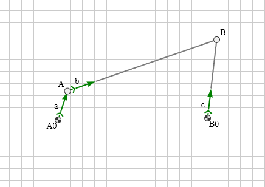

[](https://www.npmjs.com/package/mec2)

# mec2

*mec2* is a javascript library for simulating and analysing planar mechanisms or linkages. The concept is based on *nodes* constrained by one of four different vectors. Solving the kinematic equations is done by using Erin Catto's principle of [sequential impulses](http://box2d.org/downloads/), often used by gaming physics engines.

Its API is minimal and easy to understand. The library is tiny and fast. Mechanisms are described using an easy to read JSON format.

## Example



## JSON

```json
{
    "id":"4bar",
    "nodes": [
        { "id":"A0","x":100,"y":100,"base":true },
        { "id":"A", "x":100,"y":150 },
        { "id":"B", "x":350,"y":220 },
        { "id":"B0","x":300,"y":100,"base":true }
    ],
    "constraints": [
        { "id":"a","p1":"A0","p2":"A","len":{ "type":"const" } },
        { "id":"b","p1":"A", "p2":"B","len":{ "type":"const" } },
        { "id":"c","p1":"B0","p2":"B","len":{ "type":"const" } }
    ]
}
```

## Documentation

- todo -

## How do i use it?
You can build an environment yourself.

Here's a minimal example:


```html
<html>
<head>
    <title>minimal mec2 example</title>
    <meta charset='utf-8'>
</head>
<body>
    <canvas id="c" width="601" height="401"></canvas>

    <script src="https://gitcdn.xyz/repo/goessner/g2/master/src/g2.js"></script>
    <script src="https://gitcdn.xyz/repo/goessner/mec2/master/mec2.min.js"></script>

    <script>
        const ctx = document.getElementById('c').getContext('2d');  // the canvas-context
        let   g = g2().clr().view({cartesian:true}).grid(),         // a g2 graphics-object
              model = {                                             // your model
                id: 'pendulum',
                gravity:true,
                nodes: [
                    {id:'A0',x:300,y:240,base:true},
                    {id:'A1',x:380,y:300}
                ],
                constraints: [
                    { id:'a',p1:'A0',p2:'A1',len:{type:'const'} }
                ]
              };
          
        // simulation
        const simulate = () => {       
                  model.tick(1/60);                 // solve model with fixed stepping
                  g.exe(ctx);                       // render its pose on the canvas
                  requestAnimationFrame(simulate);  // keep calling back
              };

        mec.model.extend(model);                    // extend the model
        model.init();                               // initialize it
        model.draw(g);                              // append model-graphics to graphics-obj  

        simulate();                                 // kick-off the simulation
    </script>
</body>
</html>
```

If you don't want to bother with that, check out the project [_mecEdit_](https://github.com/jauhl/mecEdit "mecEdit on GitHub"). _mecEdit_ is a standalone, installable editor for planar mechanisms, that uses `mec2` as a physics engine and focuses on user experience. It's hosted [here](https://jauhl.github.io/mecEdit/mecEdit.html "mecEdit").

# License
*mec2* is licensed under the terms of the MIT License.

# Change Log

### 0.8.0 - 2018-08-13

* `*.toJSON` removed.

### 0.7.9 - 2018-08-11

* info view implemented.

### 0.7.8 - 2018-08-10

* trace view implemented.

### 0.7.7 - 2018-08-09

* vector view implemented.
* view elements added.

### 0.7.6 - 2018-08-08

* spring load element added.

### 0.7.5 - 2018-08-07

* spring load element added.
* added a toJSON method to model and to all element types. model.toJSON() invokes .toJSON() on each element in the model returns a canonical JSON-representation of the model
* implemented a global darkmode flag (default false) for darker canvas backgrounds
* added a different shading for elements when they are selected and not just hovered over
* some minor bug fixes.

### 0.7.3 - 2018-08-06

* some minor bug fixes.

### 0.7.0 - 2018-08-05

* first commit.
